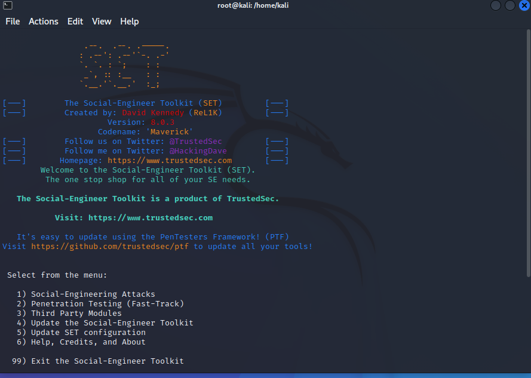
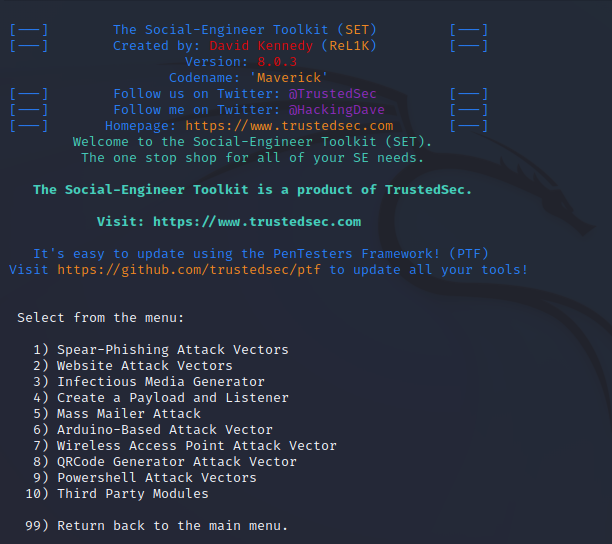
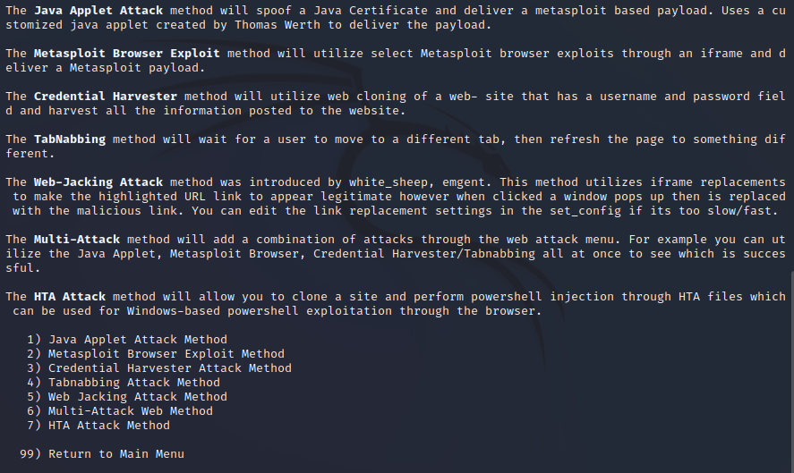
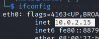
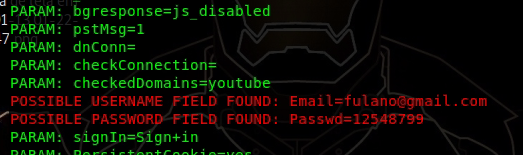

# Phishing para captura de senhas do Facebook

### Ferramentas

- Kali Linux
- setoolkit

### Configurando o Phishing no Kali Linux

- Acesso root: ``` sudo su ```
- Iniciando o setoolkit: ``` setoolkit ```

- Tipo de ataque: ``` Social-Engineering Attacks ```

- Vetor de ataque: ``` Web Site Attack Vectors ```

- Método de ataque: ```Credential Harvester Attack Method ```

- Método de ataque: ``` Site Cloner ```

- Obtendo o endereço da máquina: ``` ifconfig ```

- URL para clone: http://www.facebook.com


### Resutados

